# Diagram BPMN - Sistem Peminjaman Sarana dan Prasarana Kampus

> **Visualisasi lengkap proses bisnis aplikasi peminjaman ruangan dan barang kampus**

---

## 1. Diagram Proses Utama (Main Business Process)

### 1.1 Alur Peminjaman End-to-End

Diagram ini menunjukkan alur lengkap dari pengajuan hingga selesai:

---

## 2. Diagram BPMN Swimlane (Per Aktor)

### 2.1 Collaboration Diagram

---

## 3. State Diagram - Status Peminjaman

### 3.1 State Machine Peminjaman

---

## 4. Diagram Proses Detail

### 4.1 Proses Pengajuan Peminjaman (Create Peminjaman)

### 4.2 Proses Verifikasi oleh SARPRAS

### 4.3 Proses Verifikasi Kehadiran oleh SECURITY

---

## 5. Proses Notifikasi & Reminder

### 5.1 Sistem Notifikasi

```mermaid
flowchart LR
    subgraph Trigger["🎯 Trigger Events"]
        T1["Pengajuan Dibuat"]
        T2["Status Approved"]
        T3["Status Rejected"]
        T4["Status Cancelled"]
        T5["1 Jam Sebelum Acara"]
        T6["Kehadiran Dicatat"]
    end

    subgraph Process["⚙️ Mailbox Service"]
        P1["Generate Notifikasi"]
        P2["Simpan ke Mailbox"]
        P3["Kirim Email (Async)"]
    end

    subgraph Recipients["👥 Penerima"]
        R1["Mahasiswa/Peminjam"]
        R2["SARPRAS/Admin"]
        R3["Security"]
    end

    T1 --> P1
    T2 --> P1
    T3 --> P1
    T4 --> P1
    T5 --> P1
    T6 --> P1

    P1 --> P2
    P2 --> P3

    P3 --> R1
    P3 --> R2
    P3 --> R3
```

### 5.2 Reminder Scheduler Flow

```mermaid
sequenceDiagram
    participant Scheduler as ⏰ Scheduler
    participant MailboxSvc as 📬 Mailbox Service
    participant DB as 🗄️ Database
    participant Email as 📧 Email Service
    participant User as 👤 User

    loop Every 5 Minutes
        Scheduler->>MailboxSvc: ProcessReminders()
        MailboxSvc->>DB: Get peminjaman T-1 jam
        DB-->>MailboxSvc: List peminjaman
        
        loop Each Peminjaman
            MailboxSvc->>DB: Create mailbox notification
            MailboxSvc->>Email: SendReminderEmail (async)
            Email-->>User: Email reminder
        end
    end
```

---

## 6. Proses Pembatalan (Cancellation)

---

## 7. Diagram Use Case

```mermaid
flowchart TD
    subgraph Actors["Aktor"]
        MHS["🎓 Mahasiswa/Guest"]
        SRP["🏢 SARPRAS"]
        SEC["🔒 Security"]
        ADM["👑 Admin"]
    end

    subgraph UseCases["Use Cases"]
        UC1["📝 Mengajukan Peminjaman"]
        UC2["📄 Upload Surat Digital"]
        UC3["📅 Melihat Jadwal Ruangan"]
        UC4["📋 Melihat Riwayat Peminjaman"]
        UC5["✅ Verifikasi Peminjaman"]
        UC6["❌ Menolak Peminjaman"]
        UC7["🚫 Membatalkan Peminjaman"]
        UC8["📦 Kelola Barang"]
        UC9["🏠 Kelola Ruangan"]
        UC10["👥 Verifikasi Kehadiran"]
        UC11["📊 Lihat Laporan Peminjaman"]
        UC12["🔔 Kelola Notifikasi"]
        UC13["📜 Lihat Log Aktivitas"]
    end

    MHS --> UC1
    MHS --> UC2
    MHS --> UC3
    MHS --> UC4
    MHS --> UC12

    SRP --> UC5
    SRP --> UC6
    SRP --> UC7
    SRP --> UC8
    SRP --> UC9
    SRP --> UC11
    SRP --> UC12

    SEC --> UC3
    SEC --> UC10
    SEC --> UC12

    ADM --> UC5
    ADM --> UC6
    ADM --> UC7
    ADM --> UC8
    ADM --> UC9
    ADM --> UC10
    ADM --> UC11
    ADM --> UC12
    ADM --> UC13
```

---

## 8. Ringkasan Status dan Transisi

| Status | Deskripsi | Transisi Berikutnya | Aktor |
|--------|-----------|---------------------|-------|
| `PENDING` | Pengajuan baru dibuat | APPROVED, REJECTED | SARPRAS |
| `APPROVED` | Disetujui, menunggu hari-H | ONGOING, CANCELLED | SECURITY/SARPRAS |
| `REJECTED` | Ditolak permanen | (terminal) | - |
| `ONGOING` | Kegiatan sedang berlangsung | FINISHED, CANCELLED | System/SARPRAS |
| `FINISHED` | Kegiatan telah selesai | (terminal) | - |
| `CANCELLED` | Dibatalkan | (terminal) | - |

---

## 9. Catatan Implementasi

> [!NOTE]
> Diagram-diagram di atas merepresentasikan proses bisnis yang diimplementasikan dalam:
> - [peminjaman_service.go](file:///home/versedroid/Documents/project-2-if/proyek-2-backend/services/peminjaman_service.go) - Logika peminjaman
> - [kehadiran_service.go](file:///home/versedroid/Documents/project-2-if/proyek-2-backend/services/kehadiran_service.go) - Verifikasi kehadiran
> - [mailbox_service.go](file:///home/versedroid/Documents/project-2-if/proyek-2-backend/services/mailbox_service.go) - Sistem notifikasi

> [!TIP]
> Untuk melihat diagram secara interaktif, Anda dapat:
> 1. Copy Mermaid code ke [Mermaid Live Editor](https://mermaid.live)
> 2. Menggunakan ekstensi VS Code "Markdown Preview Mermaid Support"
> 3. Export ke format gambar (PNG/SVG) dari Mermaid Live Editor
