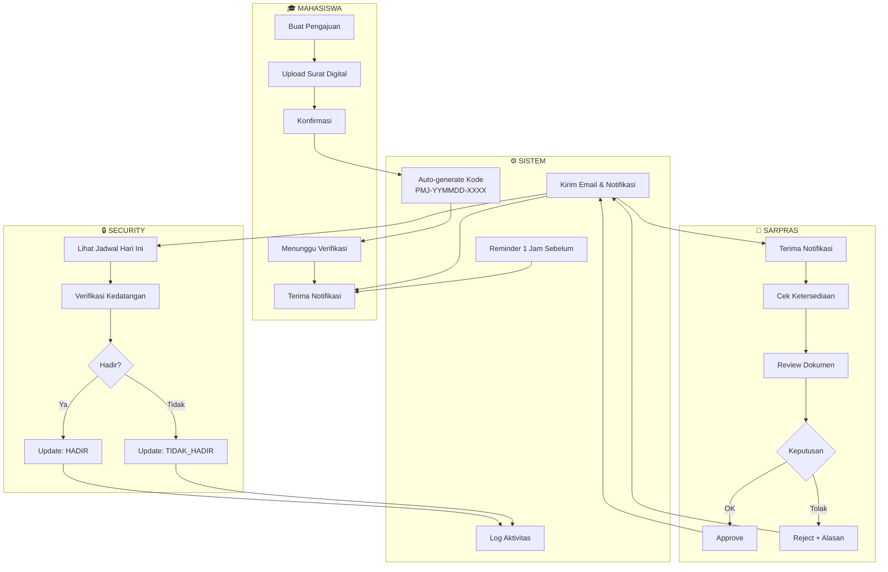

# Diagram BPMN Swimlane - Kolaborasi Antar Aktor

> Menunjukkan interaksi antara System, Mahasiswa, Sarpras, dan Security

```mermaid
flowchart TB
    subgraph System["⚙️ SISTEM"]
        SYS1["Auto-generate Kode<br/>PMJ-YYMMDD-XXXX"]
        SYS2["Kirim Email & Notifikasi"]
        SYS3["Reminder 1 Jam Sebelum"]
        SYS4["Log Aktivitas"]
    end

    subgraph Mahasiswa["🎓 MAHASISWA"]
        M1["Buat Pengajuan"] --> M2["Upload Surat Digital"]
        M2 --> M3["Konfirmasi"]
        M3 --> SYS1
        SYS1 --> M4["Menunggu Verifikasi"]
        M4 --> M5["Terima Notifikasi"]
    end

    subgraph Sarpras["🏢 SARPRAS"]
        S1["Terima Notifikasi"] --> S2["Cek Ketersediaan"]
        S2 --> S3["Review Dokumen"]
        S3 --> S4{"Keputusan"}
        S4 -->|OK| S5["Approve"]
        S4 -->|Tolak| S6["Reject + Alasan"]
        S5 --> SYS2
        S6 --> SYS2
    end

    subgraph Security["🔒 SECURITY"]
        SC1["Lihat Jadwal Hari Ini"] --> SC2["Verifikasi Kedatangan"]
        SC2 --> SC3{"Hadir?"}
        SC3 -->|Ya| SC4["Update: HADIR"]
        SC3 -->|Tidak| SC5["Update: TIDAK_HADIR"]
        SC4 --> SYS4
        SC5 --> SYS4
    end

    SYS2 --> S1
    SYS2 --> M5
    SYS2 --> SC1
    SYS3 --> M5
```
