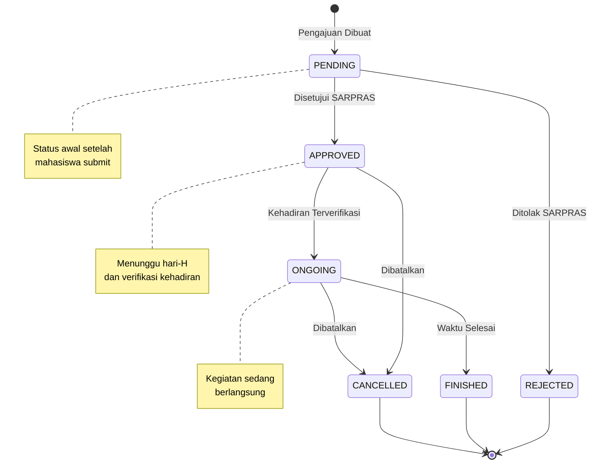

# State Diagram - Status Peminjaman

> State Machine menunjukkan transisi status peminjaman

## Ringkasan Status dan Transisi

| Status | Deskripsi | Transisi Berikutnya | Aktor |
|--------|-----------|---------------------|-------|
| `PENDING` | Pengajuan baru dibuat | APPROVED, REJECTED | SARPRAS |
| `APPROVED` | Disetujui, menunggu hari-H | ONGOING, CANCELLED | SECURITY/SARPRAS |
| `REJECTED` | Ditolak permanen | (terminal) | - |
| `ONGOING` | Kegiatan sedang berlangsung | FINISHED, CANCELLED | System/SARPRAS |
| `FINISHED` | Kegiatan telah selesai | (terminal) | - |
| `CANCELLED` | Dibatalkan | (terminal) | - |
