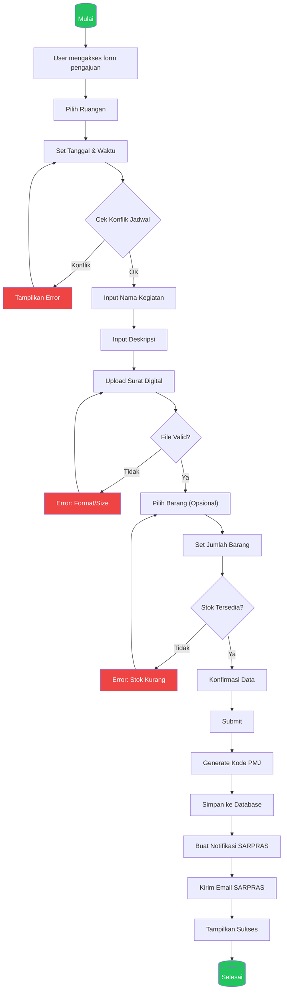

# Proses Pengajuan Peminjaman (Create Peminjaman)

> Detail proses ketika mahasiswa mengajukan peminjaman baru

```mermaid
flowchart TD
    A[("Mulai")] --> B["User mengakses form pengajuan"]
    B --> C["Pilih Ruangan"]
    C --> D["Set Tanggal & Waktu"]
    D --> E{"Cek Konflik Jadwal"}
    E -->|Konflik| F["Tampilkan Error"]
    F --> D
    E -->|OK| G["Input Nama Kegiatan"]
    G --> H["Input Deskripsi"]
    H --> I["Upload Surat Digital"]
    I --> J{"File Valid?"}
    J -->|Tidak| K["Error: Format/Size"]
    K --> I
    J -->|Ya| L["Pilih Barang (Opsional)"]
    L --> M["Set Jumlah Barang"]
    M --> N{"Stok Tersedia?"}
    N -->|Tidak| O["Error: Stok Kurang"]
    O --> L
    N -->|Ya| P["Konfirmasi Data"]
    P --> Q["Submit"]
    Q --> R["Generate Kode PMJ"]
    R --> S["Simpan ke Database"]
    S --> T["Buat Notifikasi SARPRAS"]
    T --> U["Kirim Email SARPRAS"]
    U --> V["Tampilkan Sukses"]
    V --> W[("Selesai")]

    style A fill:#22c55e,color:#fff
    style W fill:#22c55e,color:#fff
    style F fill:#ef4444,color:#fff
    style K fill:#ef4444,color:#fff
    style O fill:#ef4444,color:#fff
```
