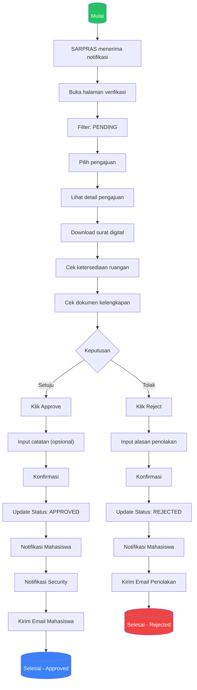

# Proses Verifikasi oleh SARPRAS

> Detail proses ketika SARPRAS memverifikasi pengajuan peminjaman

```mermaid
flowchart TD
    A[("Mulai")] --> B["SARPRAS menerima notifikasi"]
    B --> C["Buka halaman verifikasi"]
    C --> D["Filter: PENDING"]
    D --> E["Pilih pengajuan"]
    E --> F["Lihat detail pengajuan"]
    F --> G["Download surat digital"]
    G --> H["Cek ketersediaan ruangan"]
    H --> I["Cek dokumen kelengkapan"]
    I --> J{"Keputusan"}
    
    J -->|Setuju| K["Klik Approve"]
    K --> L["Input catatan (opsional)"]
    L --> M["Konfirmasi"]
    M --> N["Update Status: APPROVED"]
    N --> O["Notifikasi Mahasiswa"]
    O --> P["Notifikasi Security"]
    P --> Q["Kirim Email Mahasiswa"]
    Q --> R[("Selesai - Approved")]
    
    J -->|Tolak| S["Klik Reject"]
    S --> T["Input alasan penolakan"]
    T --> U["Konfirmasi"]
    U --> V["Update Status: REJECTED"]
    V --> W["Notifikasi Mahasiswa"]
    W --> X["Kirim Email Penolakan"]
    X --> Y[("Selesai - Rejected")]

    style A fill:#22c55e,color:#fff
    style R fill:#3b82f6,color:#fff
    style Y fill:#ef4444,color:#fff
```
