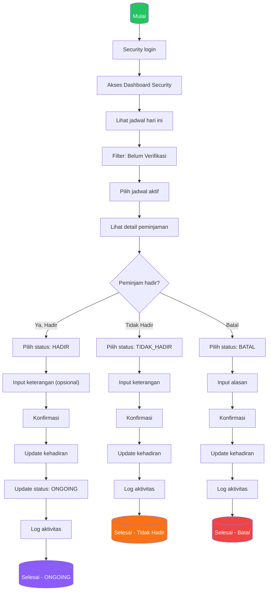

# Proses Verifikasi Kehadiran oleh SECURITY

> Detail proses ketika Security memverifikasi kehadiran peminjam

```mermaid
flowchart TD
    A[("Mulai")] --> B["Security login"]
    B --> C["Akses Dashboard Security"]
    C --> D["Lihat jadwal hari ini"]
    D --> E["Filter: Belum Verifikasi"]
    E --> F["Pilih jadwal aktif"]
    F --> G["Lihat detail peminjaman"]
    G --> H{"Peminjam hadir?"}
    
    H -->|Ya, Hadir| I["Pilih status: HADIR"]
    I --> J["Input keterangan (opsional)"]
    J --> K["Konfirmasi"]
    K --> L["Update kehadiran"]
    L --> M["Update status: ONGOING"]
    M --> N["Log aktivitas"]
    N --> O[("Selesai - ONGOING")]
    
    H -->|Tidak Hadir| P["Pilih status: TIDAK_HADIR"]
    P --> Q["Input keterangan"]
    Q --> R["Konfirmasi"]
    R --> S["Update kehadiran"]
    S --> T["Log aktivitas"]
    T --> U[("Selesai - Tidak Hadir")]
    
    H -->|Batal| V["Pilih status: BATAL"]
    V --> W["Input alasan"]
    W --> X["Konfirmasi"]
    X --> Y["Update kehadiran"]
    Y --> Z["Log aktivitas"]
    Z --> AA[("Selesai - Batal")]

    style A fill:#22c55e,color:#fff
    style O fill:#8b5cf6,color:#fff
    style U fill:#f97316,color:#fff
    style AA fill:#ef4444,color:#fff
```
