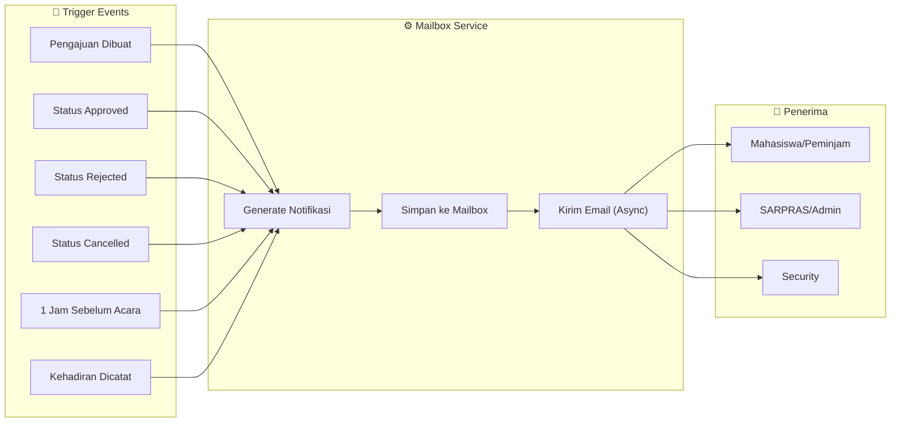
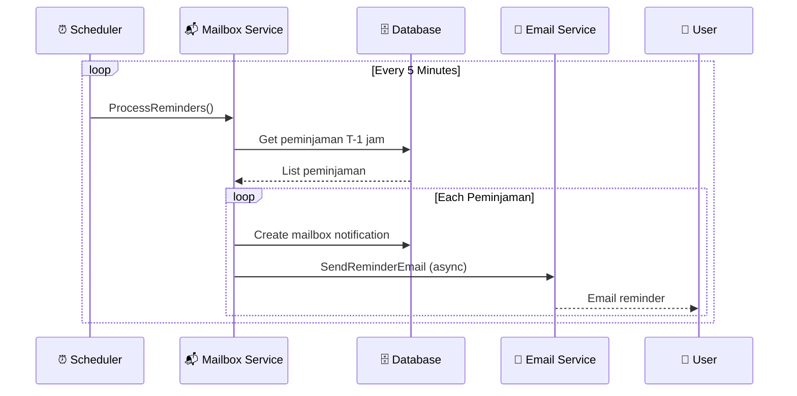

# Sistem Notifikasi & Reminder

> Alur sistem notifikasi dan reminder scheduler

## Flow Notifikasi

```mermaid
flowchart LR
    subgraph Trigger["🎯 Trigger Events"]
        T1["Pengajuan Dibuat"]
        T2["Status Approved"]
        T3["Status Rejected"]
        T4["Status Cancelled"]
        T5["1 Jam Sebelum Acara"]
        T6["Kehadiran Dicatat"]
    end

    subgraph Process["⚙️ Mailbox Service"]
        P1["Generate Notifikasi"]
        P2["Simpan ke Mailbox"]
        P3["Kirim Email (Async)"]
    end

    subgraph Recipients["👥 Penerima"]
        R1["Mahasiswa/Peminjam"]
        R2["SARPRAS/Admin"]
        R3["Security"]
    end

    T1 --> P1
    T2 --> P1
    T3 --> P1
    T4 --> P1
    T5 --> P1
    T6 --> P1

    P1 --> P2
    P2 --> P3

    P3 --> R1
    P3 --> R2
    P3 --> R3
```

## Reminder Scheduler Sequence

```mermaid
sequenceDiagram
    participant Scheduler as ⏰ Scheduler
    participant MailboxSvc as 📬 Mailbox Service
    participant DB as 🗄️ Database
    participant Email as 📧 Email Service
    participant User as 👤 User

    loop Every 5 Minutes
        Scheduler->>MailboxSvc: ProcessReminders()
        MailboxSvc->>DB: Get peminjaman T-1 jam
        DB-->>MailboxSvc: List peminjaman
        
        loop Each Peminjaman
            MailboxSvc->>DB: Create mailbox notification
            MailboxSvc->>Email: SendReminderEmail (async)
            Email-->>User: Email reminder
        end
    end
```
