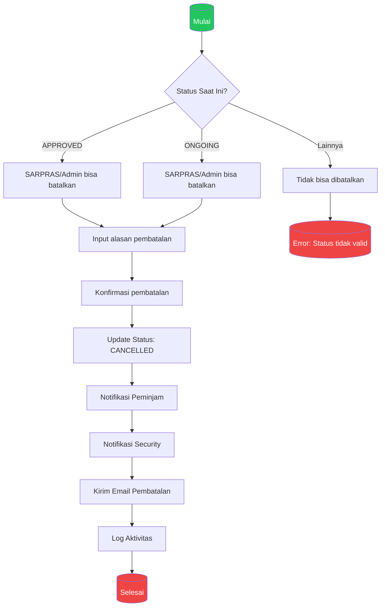

# Proses Pembatalan (Cancellation)

> Detail proses pembatalan peminjaman oleh SARPRAS/Admin

## Status yang Dapat Dibatalkan

| Status Awal | Dapat Dibatalkan? | Aktor |
|-------------|-------------------|-------|
| `PENDING` | ❌ Tidak | - |
| `APPROVED` | ✅ Ya | SARPRAS, ADMIN |
| `REJECTED` | ❌ Tidak | - |
| `ONGOING` | ✅ Ya | SARPRAS, ADMIN |
| `FINISHED` | ❌ Tidak | - |
| `CANCELLED` | ❌ Tidak | - |
