# Diagram Use Case

> Menunjukkan use case per aktor dalam sistem

```mermaid
flowchart TD
    subgraph Actors["Aktor"]
        MHS["🎓 Mahasiswa/Guest"]
        SRP["🏢 SARPRAS"]
        SEC["🔒 Security"]
        ADM["👑 Admin"]
    end

    subgraph UseCases["Use Cases"]
        UC1["📝 Mengajukan Peminjaman"]
        UC2["📄 Upload Surat Digital"]
        UC3["📅 Melihat Jadwal Ruangan"]
        UC4["📋 Melihat Riwayat Peminjaman"]
        UC5["✅ Verifikasi Peminjaman"]
        UC6["❌ Menolak Peminjaman"]
        UC7["🚫 Membatalkan Peminjaman"]
        UC8["📦 Kelola Barang"]
        UC9["🏠 Kelola Ruangan"]
        UC10["👥 Verifikasi Kehadiran"]
        UC11["📊 Lihat Laporan Peminjaman"]
        UC12["🔔 Kelola Notifikasi"]
        UC13["📜 Lihat Log Aktivitas"]
    end

    MHS --> UC1
    MHS --> UC2
    MHS --> UC3
    MHS --> UC4
    MHS --> UC12

    SRP --> UC5
    SRP --> UC6
    SRP --> UC7
    SRP --> UC8
    SRP --> UC9
    SRP --> UC11
    SRP --> UC12

    SEC --> UC3
    SEC --> UC10
    SEC --> UC12

    ADM --> UC5
    ADM --> UC6
    ADM --> UC7
    ADM --> UC8
    ADM --> UC9
    ADM --> UC10
    ADM --> UC11
    ADM --> UC12
    ADM --> UC13
```

## Matriks Akses Role

| Use Case | MAHASISWA | SARPRAS | SECURITY | ADMIN |
|----------|-----------|---------|----------|-------|
| Mengajukan Peminjaman | ✅ | ✅ | ❌ | ✅ |
| Upload Surat Digital | ✅ | ✅ | ❌ | ✅ |
| Melihat Jadwal Ruangan | ✅ | ✅ | ✅ | ✅ |
| Melihat Riwayat Peminjaman | ✅ | ✅ | ❌ | ✅ |
| Verifikasi Peminjaman | ❌ | ✅ | ❌ | ✅ |
| Menolak Peminjaman | ❌ | ✅ | ❌ | ✅ |
| Membatalkan Peminjaman | ❌ | ✅ | ❌ | ✅ |
| Kelola Barang | ❌ | ✅ | ❌ | ✅ |
| Kelola Ruangan | ❌ | ✅ | ❌ | ✅ |
| Verifikasi Kehadiran | ❌ | ❌ | ✅ | ✅ |
| Lihat Laporan Peminjaman | ❌ | ✅ | ❌ | ✅ |
| Kelola Notifikasi | ✅ | ✅ | ✅ | ✅ |
| Lihat Log Aktivitas | ❌ | ❌ | ❌ | ✅ |
