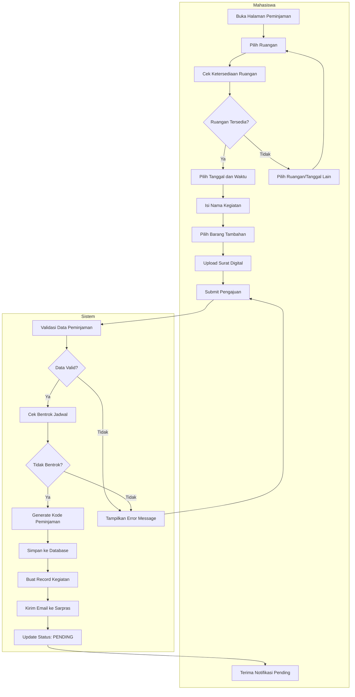
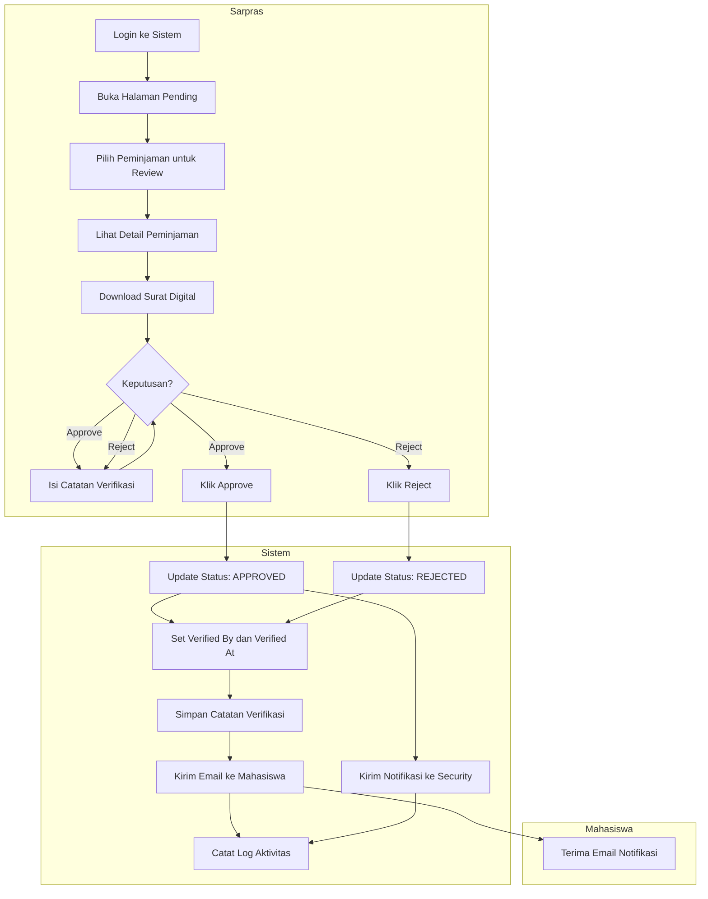
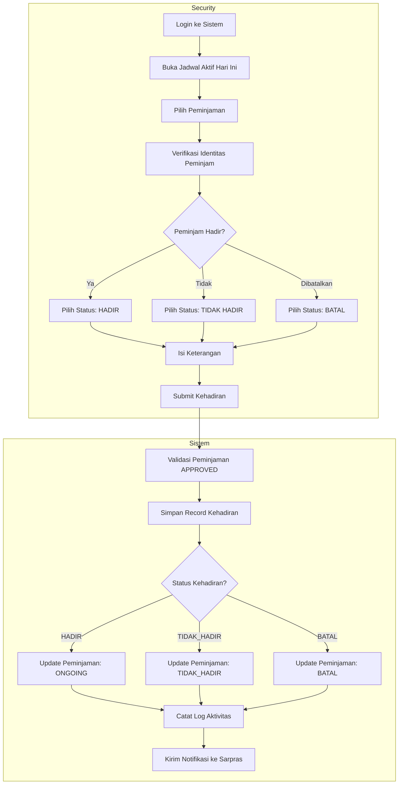
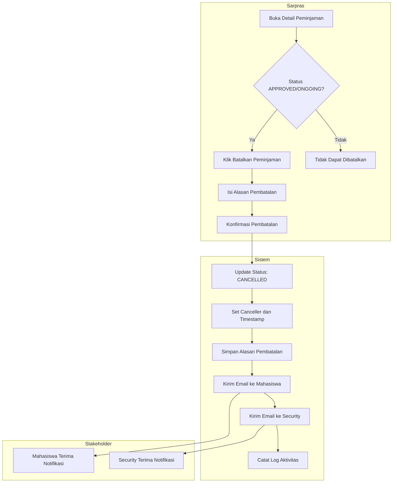
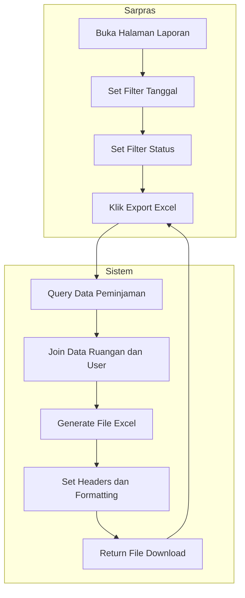
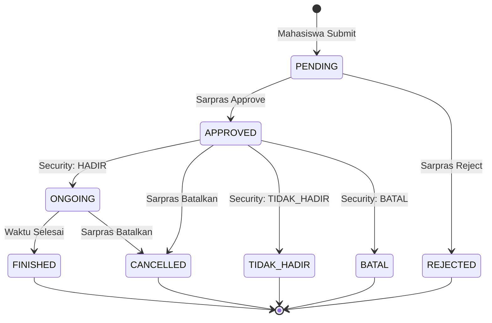

# Activity Diagram - Sistem Peminjaman Sarana Prasarana

Activity diagram menggambarkan alur aktivitas dalam sistem secara detail.

---

## 1. Proses Pengajuan Peminjaman

---

## 2. Proses Verifikasi oleh Sarpras

---

## 3. Proses Verifikasi Kehadiran oleh Security

---

## 4. Proses Pembatalan Peminjaman

---

## 5. Proses Export Laporan

---

## 6. State Diagram - Status Peminjaman

---

## Ringkasan Aktivitas per Role

| Role | Aktivitas Utama |
|------|----------------|
| **Mahasiswa** | Mengajukan peminjaman, Upload surat, Melihat status |
| **Sarpras** | Verifikasi peminjaman, Kelola master data, Membatalkan peminjaman, Export laporan |
| **Security** | Verifikasi kehadiran, Melihat jadwal aktif |
| **Admin** | Semua aktivitas + Melihat log sistem |
