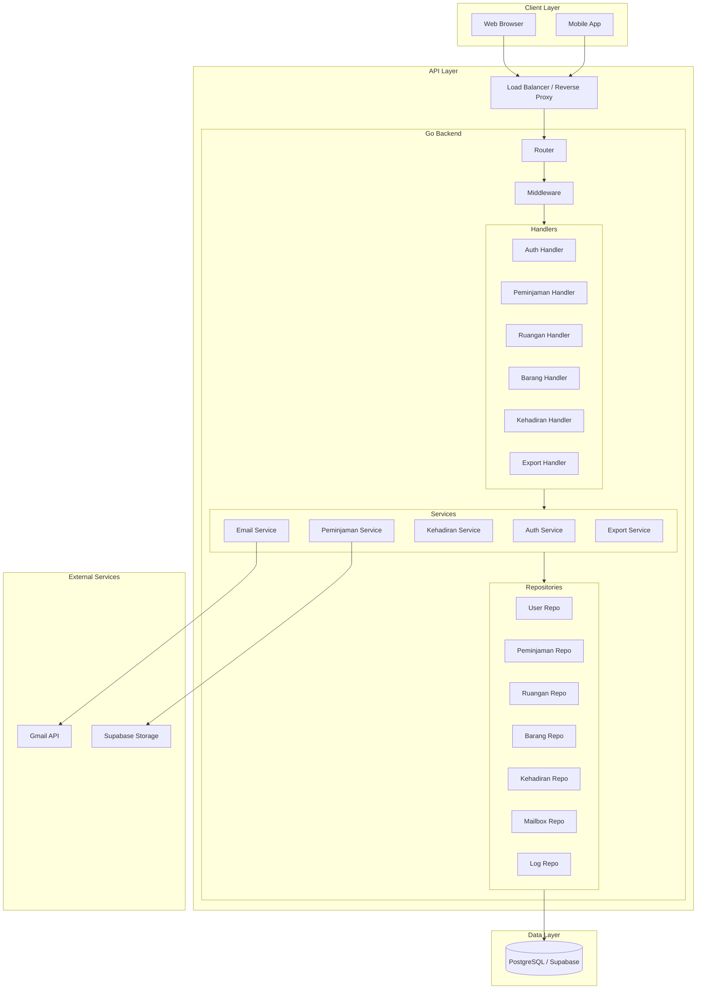
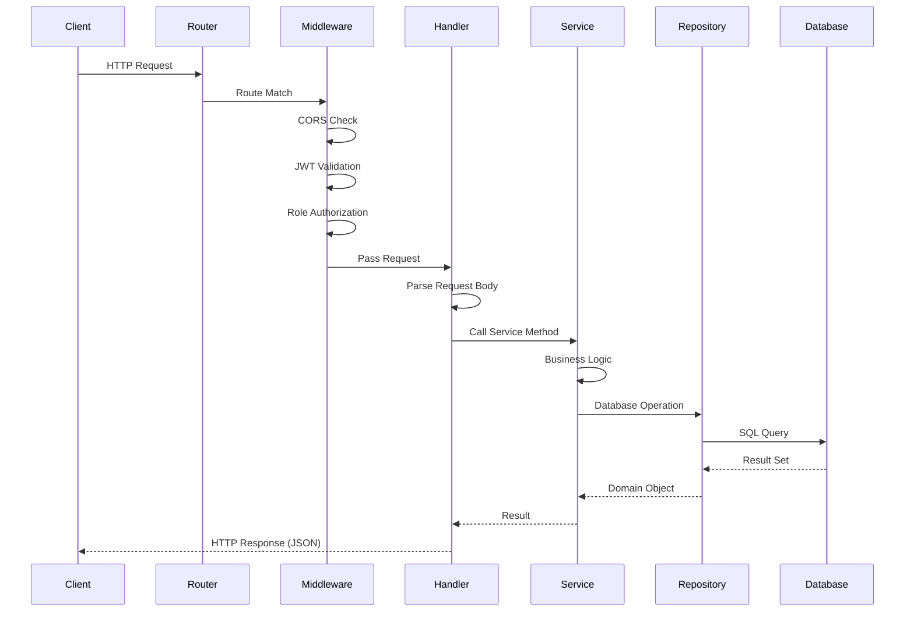
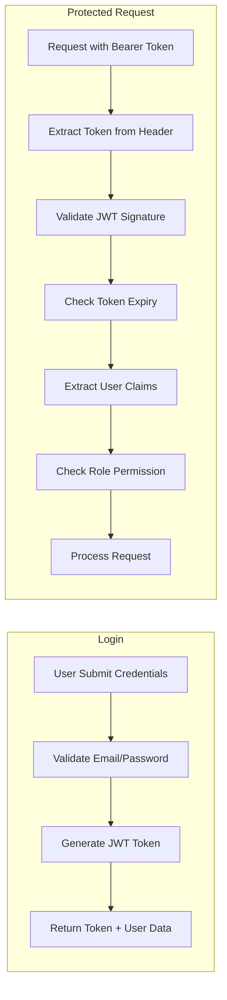
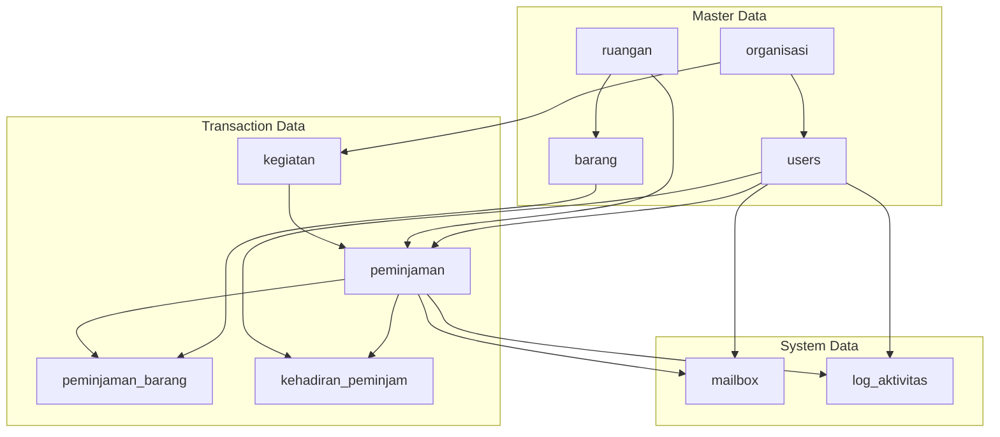

# Architecture Overview - Sistem Peminjaman Sarana Prasarana

Dokumen ini menjelaskan arsitektur sistem secara keseluruhan.

---

## Arsitektur Sistem

```
+------------------+          +------------------+          +------------------+
|                  |   HTTP   |                  |   SQL    |                  |
|    Frontend      |<-------->|    Backend API   |<-------->|    Database      |
|    (React/Next)  |   REST   |    (Go Native)   |   pgx    |   (PostgreSQL)   |
|                  |          |                  |          |    Supabase      |
+------------------+          +------------------+          +------------------+
                                      |
                                      | OAuth2
                                      v
                              +------------------+
                              |                  |
                              |    Gmail API     |
                              |   (Notification) |
                              |                  |
                              +------------------+
                                      
                              +------------------+
                              |                  |
                              | Supabase Storage |
                              |   (File Upload)  |
                              |                  |
                              +------------------+
```

---

## Diagram Arsitektur Detail



---

## Layered Architecture

Sistem menggunakan arsitektur berlapis (Layered Architecture):

```
+-----------------------------------------------------------+
|                      PRESENTATION LAYER                    |
|  (Handlers - HTTP Request/Response)                        |
+-----------------------------------------------------------+
                              |
                              v
+-----------------------------------------------------------+
|                      BUSINESS LOGIC LAYER                  |
|  (Services - Core Business Rules)                          |
+-----------------------------------------------------------+
                              |
                              v
+-----------------------------------------------------------+
|                      DATA ACCESS LAYER                     |
|  (Repositories - Database Operations)                      |
+-----------------------------------------------------------+
                              |
                              v
+-----------------------------------------------------------+
|                      DATABASE LAYER                        |
|  (PostgreSQL via Supabase)                                 |
+-----------------------------------------------------------+
```

### Penjelasan Setiap Layer

| Layer | Komponen | Tanggung Jawab |
|-------|----------|----------------|
| **Presentation** | Handlers | Menerima HTTP request, validasi input, mengembalikan response |
| **Business Logic** | Services | Implementasi aturan bisnis, koordinasi antar repository |
| **Data Access** | Repositories | Operasi CRUD ke database, query building |
| **Database** | PostgreSQL | Penyimpanan data persisten |

---

## Komponen Utama

### 1. Internal Config

```
internal/
├── config/
│   ├── config.go          # Environment variables
│   ├── gmail.go           # Gmail OAuth2 config
│   └── supabase.go        # Supabase connection
├── db/
│   └── db.go              # Database connection pool
├── router/
│   └── router.go          # Route definitions
└── services/
    ├── email_service.go   # Gmail API integration
    ├── email_templates.go # HTML email templates
    ├── status_scheduler.go# Auto status update
    └── storage_service.go # Supabase storage
```

### 2. Business Domain

```
models/          # Data structures
repositories/    # Database operations
services/        # Business logic
handlers/        # HTTP controllers
middleware/      # Auth, CORS
```

---

## Request Flow



---

## Security Architecture

### Authentication Flow



### Security Measures

| Aspek | Implementasi |
|-------|--------------|
| **Authentication** | JWT Bearer Token |
| **Password** | bcrypt hashing (cost factor 10) |
| **Authorization** | Role-based Access Control (RBAC) |
| **CORS** | Configurable allowed origins |
| **SQL Injection** | Parameterized queries (pgx) |
| **Token Expiry** | 24 hours default |

---

## Database Design

### Schema Overview



### Database Features

- **Auto-generated Codes**: Triggers untuk generate kode unik
- **Timestamps**: created_at dan updated_at otomatis
- **Foreign Keys**: Referential integrity
- **Enums**: Type-safe status values

---

## External Integrations

### 1. Supabase Storage

```
Purpose: File storage untuk surat digital
Bucket: surat-digital
File Path: peminjaman/{kode_peminjaman}/surat.pdf
Max Size: 2MB
Format: PDF only
```

### 2. Gmail API

```
Purpose: Notifikasi email otomatis
OAuth2: Service account atau user credentials
Templates: HTML email templates
Types:
  - New Submission (ke Sarpras)
  - Approved/Rejected (ke Mahasiswa)
  - Security Notification (ke Security)
  - Cancellation (ke semua pihak)
```

---

## Deployment Architecture

```
+------------------+     +------------------+     +------------------+
|   Development    |     |     Staging      |     |    Production    |
+------------------+     +------------------+     +------------------+
|                  |     |                  |     |                  |
|  localhost:8000  |     |  staging.xyz.com |     |  api.xyz.com     |
|                  |     |                  |     |                  |
|  Air hot-reload  |     |  Docker          |     |  Docker/K8s      |
|  Local Postgres  |     |  Supabase Dev    |     |  Supabase Prod   |
|                  |     |                  |     |  Cloudflare CDN  |
|                  |     |                  |     |  SSL/TLS         |
+------------------+     +------------------+     +------------------+
```

### Environment Variables

| Variable | Description | Required |
|----------|-------------|----------|
| `DATABASE_URL` | PostgreSQL connection string | Yes |
| `PORT` | Server port | No (default: 8000) |
| `JWT_SECRET` | Secret for JWT signing | Yes |
| `SUPABASE_URL` | Supabase project URL | Yes |
| `SUPABASE_SERVICE_KEY` | Supabase service role key | Yes |
| `SUPABASE_BUCKET_NAME` | Storage bucket name | Yes |
| `GMAIL_CREDENTIALS_FILE` | Path to Gmail credentials | No |
| `GMAIL_TOKEN_FILE` | Path to Gmail OAuth token | No |
| `CORS_ALLOWED_ORIGIN` | Allowed CORS origins | No (default: *) |

---

## Performance Considerations

### Optimizations Implemented

1. **Connection Pooling**: pgx connection pool for database
2. **Batch Queries**: GetPeminjamanBarangByIDs for bulk fetch
3. **Async Email**: Goroutines for non-blocking email sending
4. **Minimal JSON**: Password hash excluded from responses
5. **Index**: Primary keys dan foreign keys indexed

### Recommendations

1. Add Redis for session caching
2. Implement rate limiting
3. Add request logging middleware
4. Consider GraphQL for flexible queries
5. Add health check endpoints for monitoring

---

## Error Handling

```go
// Standard error response format
{
  "error": "Error message description"
}

// HTTP Status Codes used:
// 200 - Success
// 201 - Created
// 400 - Bad Request (validation error)
// 401 - Unauthorized (no/invalid token)
// 403 - Forbidden (insufficient role)
// 404 - Not Found
// 500 - Internal Server Error
```
