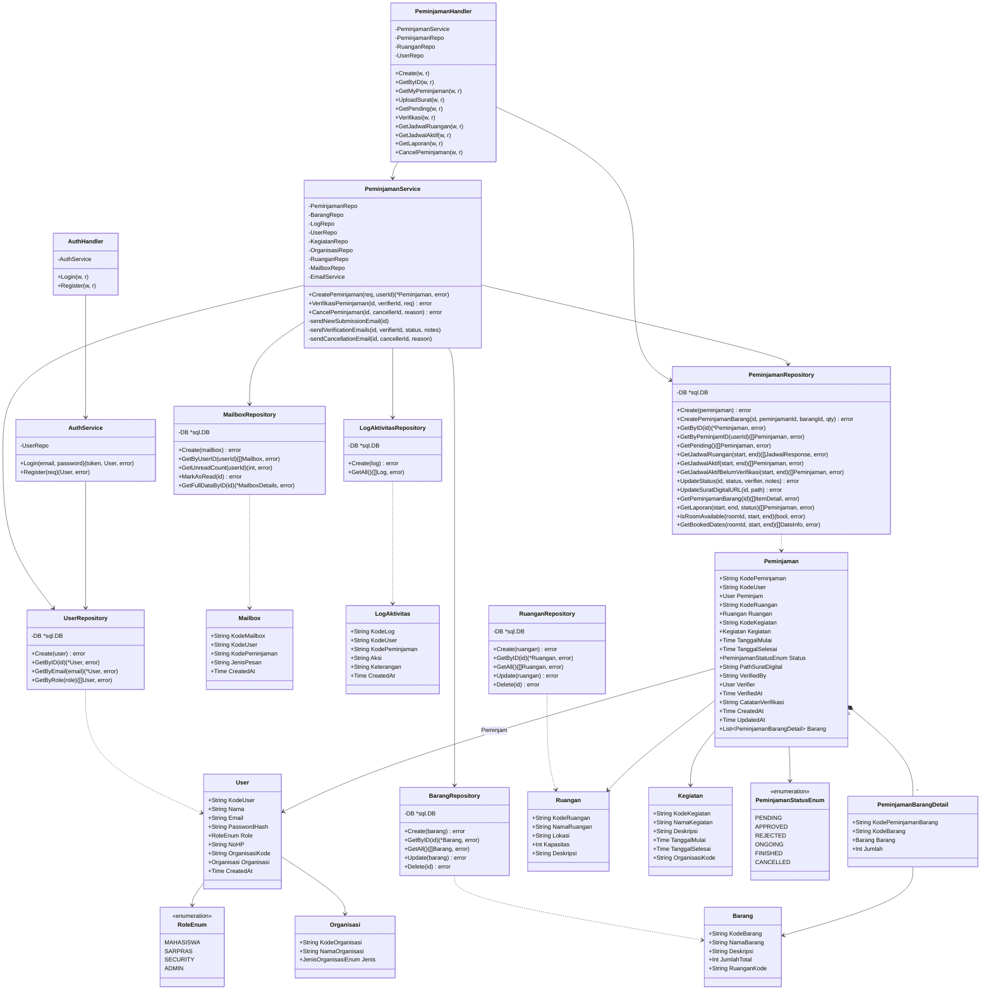

# Class Diagram - Sistem Peminjaman Sarana Prasarana Kampus

```mermaid
classDiagram
    %% ==========================================
    %% MODELS
    %% ==========================================
    class User {
        +String KodeUser
        +String Nama
        +String Email
        +String PasswordHash
        +RoleEnum Role
        +String NoHP
        +String OrganisasiKode
        +Organisasi Organisasi
        +Time CreatedAt
    }

    class Peminjaman {
        +String KodePeminjaman
        +String KodeUser
        +User Peminjam
        +String KodeRuangan
        +Ruangan Ruangan
        +String KodeKegiatan
        +Kegiatan Kegiatan
        +Time TanggalMulai
        +Time TanggalSelesai
        +PeminjamanStatusEnum Status
        +String PathSuratDigital
        +String VerifiedBy
        +User Verifier
        +Time VerifiedAt
        +String CatatanVerifikasi
        +Time CreatedAt
        +Time UpdatedAt
        +List~PeminjamanBarangDetail~ Barang
    }

    class PeminjamanBarangDetail {
        +String KodePeminjamanBarang
        +String KodeBarang
        +Barang Barang
        +Int Jumlah
    }

    class Ruangan {
        +String KodeRuangan
        +String NamaRuangan
        +String Lokasi
        +Int Kapasitas
        +String Deskripsi
    }

    class Barang {
        +String KodeBarang
        +String NamaBarang
        +String Deskripsi
        +Int JumlahTotal
        +String RuanganKode
    }

    class Kegiatan {
        +String KodeKegiatan
        +String NamaKegiatan
        +String Deskripsi
        +Time TanggalMulai
        +Time TanggalSelesai
        +String OrganisasiKode
    }

    class Organisasi {
        +String KodeOrganisasi
        +String NamaOrganisasi
        +JenisOrganisasiEnum Jenis
    }

    class Mailbox {
        +String KodeMailbox
        +String KodeUser
        +String KodePeminjaman
        +String JenisPesan
        +Time CreatedAt
    }

    class LogAktivitas {
        +String KodeLog
        +String KodeUser
        +String KodePeminjaman
        +String Aksi
        +String Keterangan
        +Time CreatedAt
    }

    %% ==========================================
    %% ENUMS
    %% ==========================================
    class RoleEnum {
        <<enumeration>>
        MAHASISWA
        SARPRAS
        SECURITY
        ADMIN
    }

    class PeminjamanStatusEnum {
        <<enumeration>>
        PENDING
        APPROVED
        REJECTED
        ONGOING
        FINISHED
        CANCELLED
    }

    %% ==========================================
    %% REPOSITORIES
    %% ==========================================
    class PeminjamanRepository {
        -DB *sql.DB
        +Create(peminjaman) error
        +CreatePeminjamanBarang(id, peminjamanId, barangId, qty) error
        +GetByID(id) (*Peminjaman, error)
        +GetByPeminjamID(userId) ([]Peminjaman, error)
        +GetPending() ([]Peminjaman, error)
        +GetJadwalRuangan(start, end) ([]JadwalResponse, error)
        +GetJadwalAktif(start, end) ([]Peminjaman, error)
        +GetJadwalAktifBelumVerifikasi(start, end) ([]Peminjaman, error)
        +UpdateStatus(id, status, verifier, notes) error
        +UpdateSuratDigitalURL(id, path) error
        +GetPeminjamanBarang(id) ([]ItemDetail, error)
        +GetLaporan(start, end, status) ([]Peminjaman, error)
        +IsRoomAvailable(roomId, start, end) (bool, error)
        +GetBookedDates(roomId, start, end) ([]DateInfo, error)
    }

    class UserRepository {
        -DB *sql.DB
        +Create(user) error
        +GetByID(id) (*User, error)
        +GetByEmail(email) (*User, error)
        +GetByRole(role) ([]User, error)
    }

    class RuanganRepository {
        -DB *sql.DB
        +Create(ruangan) error
        +GetByID(id) (*Ruangan, error)
        +GetAll() ([]Ruangan, error)
        +Update(ruangan) error
        +Delete(id) error
    }

    class BarangRepository {
        -DB *sql.DB
        +Create(barang) error
        +GetByID(id) (*Barang, error)
        +GetAll() ([]Barang, error)
        +Update(barang) error
        +Delete(id) error
    }

    class MailboxRepository {
        -DB *sql.DB
        +Create(mailbox) error
        +GetByUserID(userId) ([]Mailbox, error)
        +GetUnreadCount(userId) (int, error)
        +MarkAsRead(id) error
        +GetFullDataByID(id) (*MailboxDetails, error)
    }

    class LogAktivitasRepository {
        -DB *sql.DB
        +Create(log) error
        +GetAll() ([]Log, error)
    }

    %% ==========================================
    %% SERVICES
    %% ==========================================
    class PeminjamanService {
        -PeminjamanRepo
        -BarangRepo
        -LogRepo
        -UserRepo
        -KegiatanRepo
        -OrganisasiRepo
        -RuanganRepo
        -MailboxRepo
        -EmailService
        +CreatePeminjaman(req, userId) (*Peminjaman, error)
        +VerifikasiPeminjaman(id, verifierId, req) error
        +CancelPeminjaman(id, cancellerId, reason) error
        -sendNewSubmissionEmail(id)
        -sendVerificationEmails(id, verifierId, status, notes)
        -sendCancellationEmail(id, cancellerId, reason)
    }

    class AuthService {
        -UserRepo
        +Login(email, password) (token, User, error)
        +Register(req) (User, error)
    }

    %% ==========================================
    %% HANDLERS
    %% ==========================================
    class PeminjamanHandler {
        -PeminjamanService
        -PeminjamanRepo
        -RuanganRepo
        -UserRepo
        +Create(w, r)
        +GetByID(w, r)
        +GetMyPeminjaman(w, r)
        +UploadSurat(w, r)
        +GetPending(w, r)
        +Verifikasi(w, r)
        +GetJadwalRuangan(w, r)
        +GetJadwalAktif(w, r)
        +GetLaporan(w, r)
        +CancelPeminjaman(w, r)
    }

    class AuthHandler {
        -AuthService
        +Login(w, r)
        +Register(w, r)
    }

    %% ==========================================
    %% RELATIONSHIPS
    %% ==========================================
    
    %% Handler to Service/Repo
    PeminjamanHandler --> PeminjamanService
    PeminjamanHandler --> PeminjamanRepository
    AuthHandler --> AuthService

    %% Service to Repo
    PeminjamanService --> PeminjamanRepository
    PeminjamanService --> BarangRepository
    PeminjamanService --> MailboxRepository
    PeminjamanService --> LogAktivitasRepository
    PeminjamanService --> UserRepository
    AuthService --> UserRepository

    %% Repo to Model
    PeminjamanRepository ..> Peminjaman
    UserRepository ..> User
    RuanganRepository ..> Ruangan
    BarangRepository ..> Barang
    MailboxRepository ..> Mailbox
    LogAktivitasRepository ..> LogAktivitas

    %% Model Relationships
    User --> RoleEnum
    User --> Organisasi
    Peminjaman --> User : Peminjam
    Peminjaman --> Ruangan
    Peminjaman --> Kegiatan
    Peminjaman --> PeminjamanStatusEnum
    Peminjaman "1" *-- "*" PeminjamanBarangDetail
    PeminjamanBarangDetail --> Barang
```
