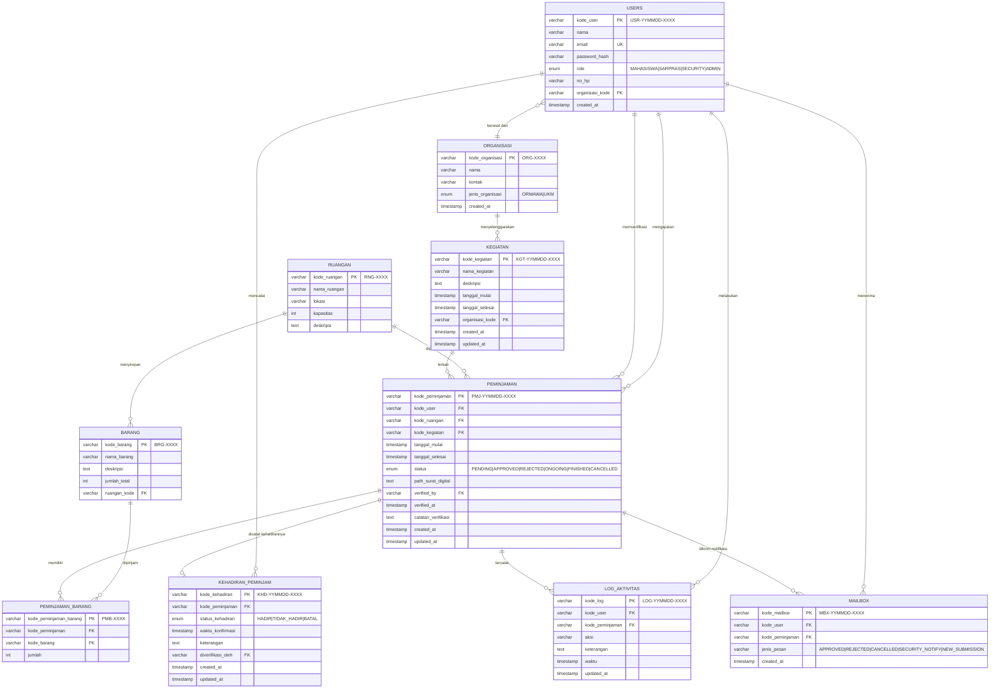

# ERD (Entity Relationship Diagram) - Sistem Peminjaman Sarana Prasarana

Diagram ini menggambarkan struktur database dan relasi antar entitas dalam sistem.

## Diagram

## Deskripsi Entitas

### Master Data

| Entitas | Deskripsi |
|---------|-----------|
| **USERS** | Data pengguna sistem (Mahasiswa, Sarpras, Security, Admin) |
| **ORGANISASI** | Organisasi kemahasiswaan (ORMAWA, UKM) |
| **RUANGAN** | Ruangan yang tersedia untuk dipinjam |
| **BARANG** | Barang inventaris yang dapat dipinjam |

### Transaksi

| Entitas | Deskripsi |
|---------|-----------|
| **KEGIATAN** | Kegiatan yang terkait dengan peminjaman |
| **PEMINJAMAN** | Transaksi peminjaman ruangan/barang |
| **PEMINJAMAN_BARANG** | Detail barang yang dipinjam (relasi many-to-many) |
| **KEHADIRAN_PEMINJAM** | Catatan kehadiran peminjam pada hari H |

### Sistem

| Entitas | Deskripsi |
|---------|-----------|
| **MAILBOX** | Log notifikasi email yang terkirim |
| **LOG_AKTIVITAS** | Audit trail aktivitas pengguna |

## Kardinalitas Relasi

| Relasi | Kardinalitas | Keterangan |
|--------|--------------|------------|
| USERS - PEMINJAMAN | 1:N | Satu user dapat memiliki banyak peminjaman |
| USERS - ORGANISASI | N:1 | Banyak user dapat berasal dari satu organisasi |
| PEMINJAMAN - RUANGAN | N:1 | Banyak peminjaman dapat menggunakan satu ruangan |
| PEMINJAMAN - PEMINJAMAN_BARANG | 1:N | Satu peminjaman dapat memiliki banyak item barang |
| PEMINJAMAN_BARANG - BARANG | N:1 | Banyak item peminjaman dapat merujuk ke satu barang |
| PEMINJAMAN - KEHADIRAN_PEMINJAM | 1:0..1 | Satu peminjaman memiliki maksimal satu catatan kehadiran |
| PEMINJAMAN - KEGIATAN | N:1 | Banyak peminjaman dapat terkait dengan satu kegiatan |
| KEGIATAN - ORGANISASI | N:1 | Banyak kegiatan dapat diselenggarakan oleh satu organisasi |

## Format Kode

| Entitas | Format | Contoh |
|---------|--------|--------|
| Users | USR-YYMMDD-XXXX | USR-260126-0001 |
| Peminjaman | PMJ-YYMMDD-XXXX | PMJ-260126-0001 |
| Kegiatan | KGT-YYMMDD-XXXX | KGT-260126-0001 |
| Kehadiran | KHD-YYMMDD-XXXX | KHD-260126-0001 |
| Mailbox | MBX-YYMMDD-XXXX | MBX-260126-0001 |
| Log | LOG-YYMMDD-XXXX | LOG-260126-0001 |
| Ruangan | RNG-XXXX | RNG-0001 |
| Barang | BRG-XXXX | BRG-0001 |
| Organisasi | ORG-XXXX | ORG-0001 |
