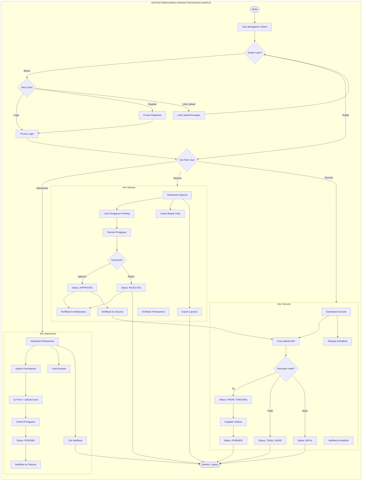
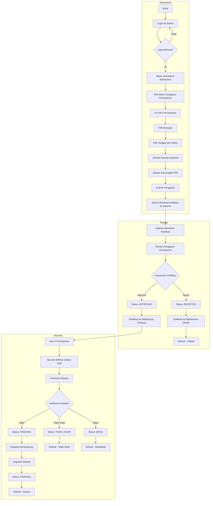
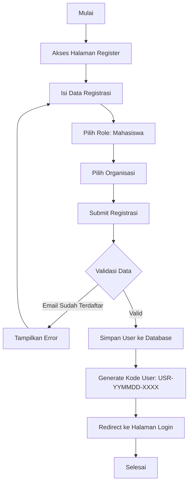
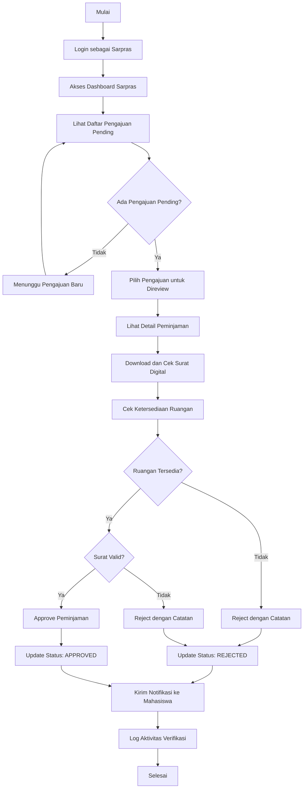
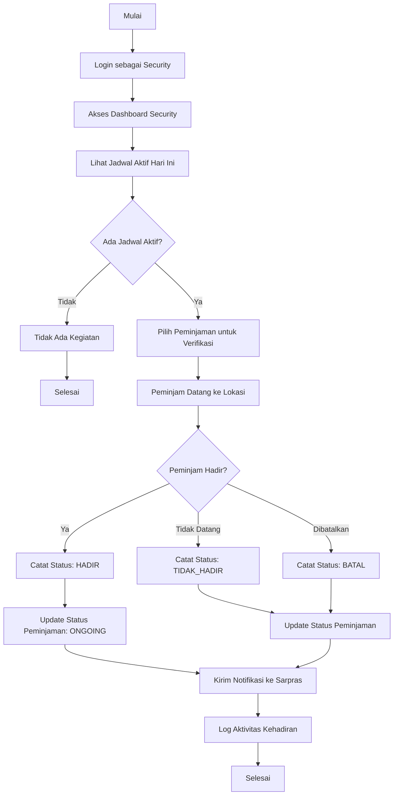
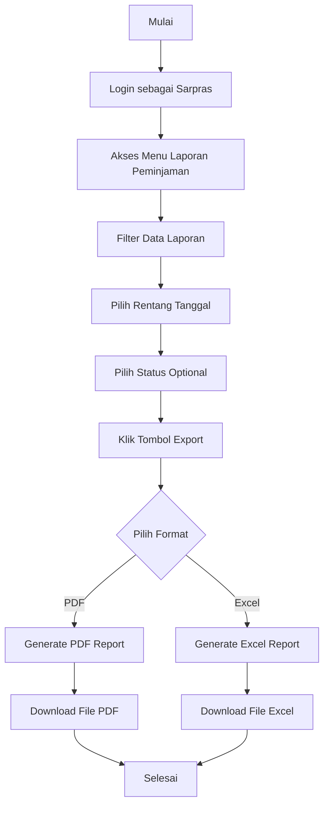
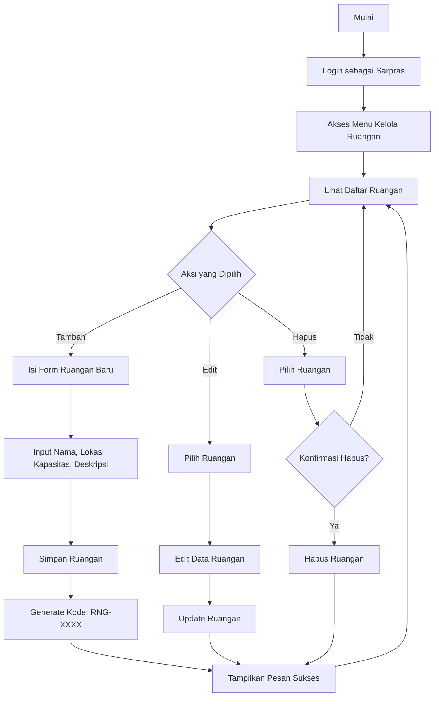

# Flowchart Diagram - Sistem Peminjaman Sarana Prasarana Kampus

## Flowchart Keseluruhan Sistem

## Flowchart Proses Utama Peminjaman

## Flowchart Proses Registrasi User

## Flowchart Proses Verifikasi Peminjaman oleh Sarpras

## Flowchart Proses Verifikasi Kehadiran oleh Security

## Flowchart Proses Export Laporan

## Flowchart Kelola Master Data Ruangan

