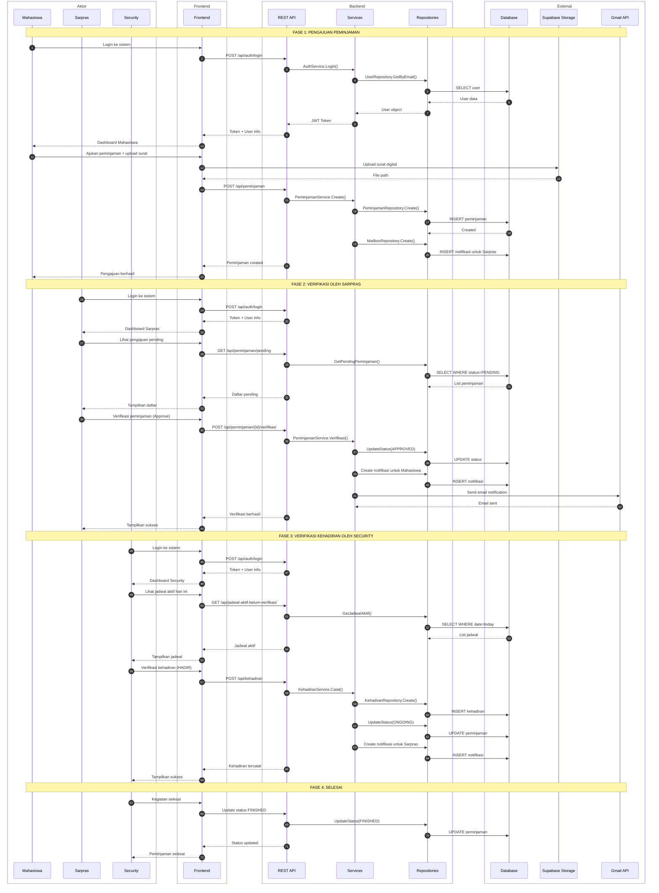
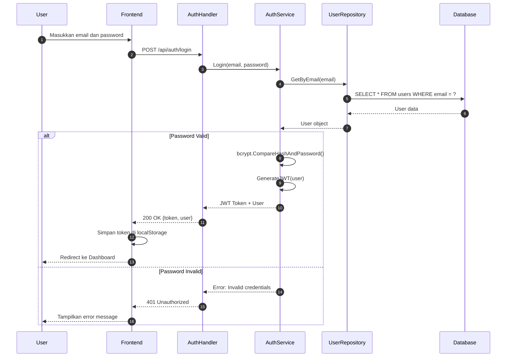
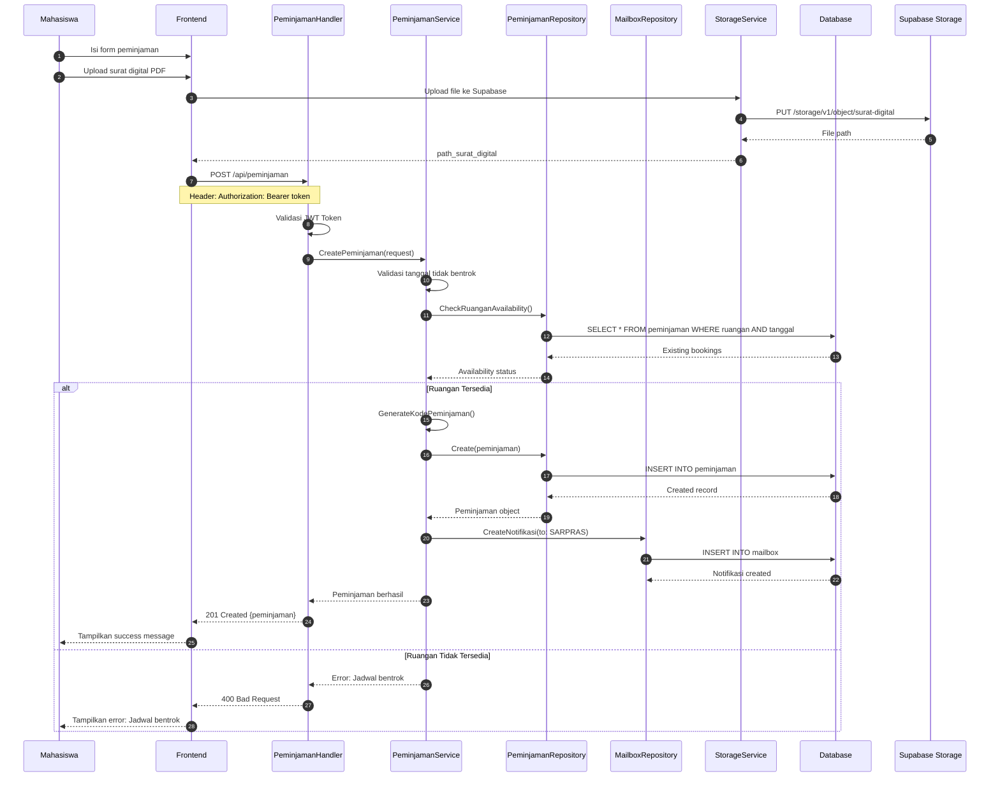
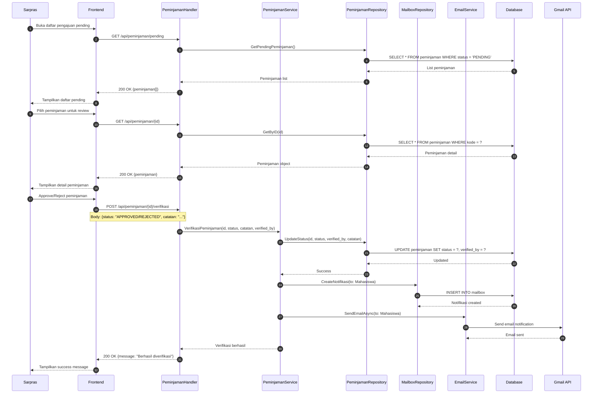
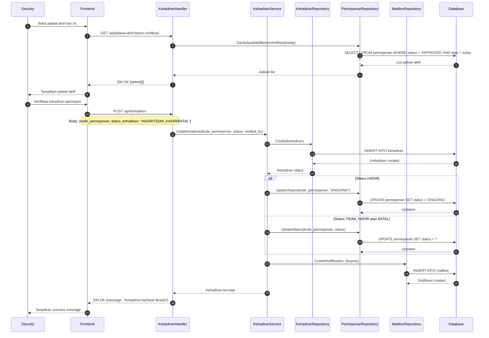
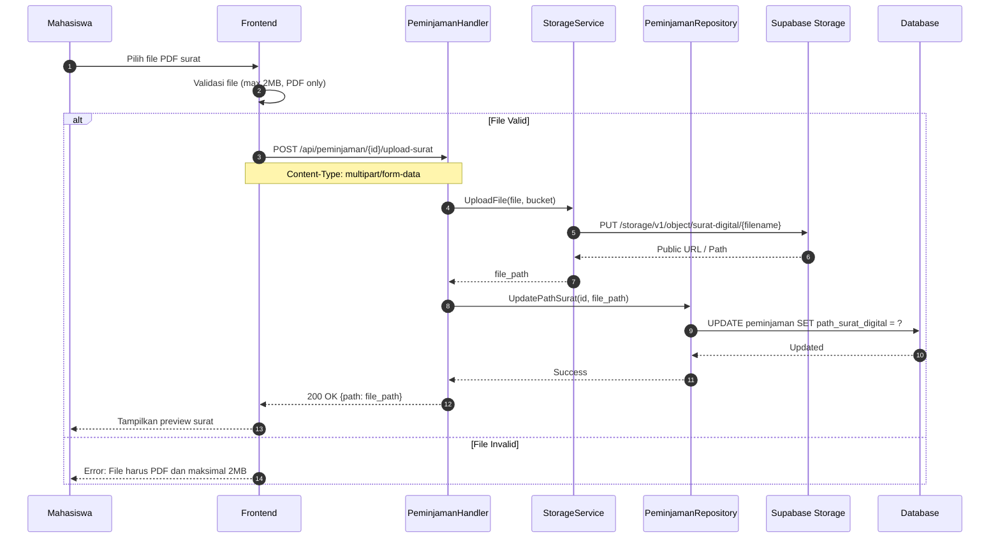
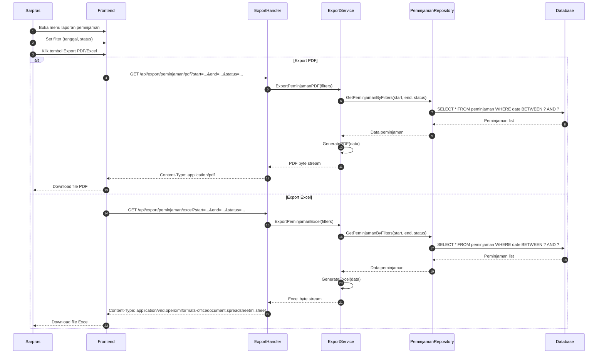
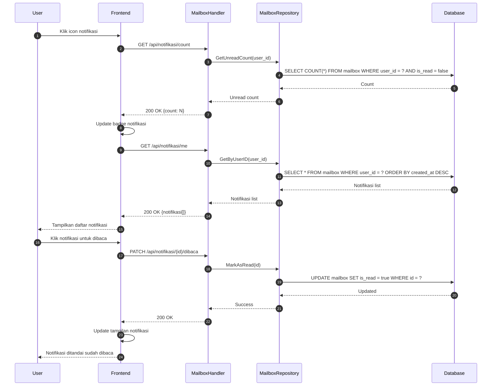

# Sequence Diagram - Sistem Peminjaman Sarana Prasarana Kampus

## Sequence Diagram Keseluruhan Sistem

## Sequence Diagram: Proses Login

## Sequence Diagram: Proses Pengajuan Peminjaman

## Sequence Diagram: Proses Verifikasi Peminjaman oleh Sarpras

## Sequence Diagram: Proses Verifikasi Kehadiran oleh Security

## Sequence Diagram: Proses Upload Surat Digital

## Sequence Diagram: Proses Export Laporan PDF/Excel

## Sequence Diagram: Proses Melihat dan Menandai Notifikasi

