# Flow Diagram Sistem Notifikasi Sarpras

Dokumen ini berisi visualisasi alur sistem notifikasi multi-channel (Email & WhatsApp) untuk aplikasi Peminjaman Sarana Prasarana Kampus.

---

## 1. Overview Arsitektur Sistem

```mermaid
flowchart TB
    subgraph Frontend["🖥️ Frontend (Vanilla JS)"]
        MHS["👨‍🎓 Mahasiswa"]
        SRP["👔 Sarpras"]
        SEC["👮 Security"]
    end
    
    subgraph Backend["⚙️ Backend (Golang)"]
        API["REST API"]
        PS["Peminjaman Service"]
        ES["Email Service"]
        WS["WhatsApp Service"]
        SCH["Scheduler (Background Worker)"]
    end
    
    subgraph External["🌐 External Services"]
        SMTP["📧 Gmail SMTP"]
        FONNTE["💬 Fonnte API"]
    end
    
    subgraph DB["🗄️ Database (Supabase)"]
        USERS["users"]
        PEMINJAMAN["peminjaman"]
        NOTIFIKASI["notifikasi"]
    end
    
    MHS --> API
    SRP --> API
    SEC --> API
    API --> PS
    PS --> ES
    PS --> WS
    PS --> DB
    ES --> SMTP
    WS --> FONNTE
    SCH --> DB
    SCH --> WS
    
    SMTP -.->|Email| MHS
    SMTP -.->|Email| SRP
    FONNTE -.->|WhatsApp| MHS
    FONNTE -.->|WhatsApp| SEC
```



---

## 2. Flow Pengajuan Peminjaman (Mahasiswa Submit)

**Trigger:** Mahasiswa submit form peminjaman baru

**Notifikasi:** Email ke semua Sarpras

```mermaid
sequenceDiagram
    autonumber
    participant M as 👨‍🎓 Mahasiswa
    participant API as ⚙️ Backend API
    participant DB as 🗄️ Database
    participant ES as 📧 Email Service
    participant SMTP as Gmail SMTP
    participant S as 👔 Sarpras

    M->>API: POST /api/peminjaman
    API->>DB: Insert peminjaman (status: PENDING)
    API->>DB: Get semua users role SARPRAS
    DB-->>API: List email Sarpras
    
    rect rgb(255, 243, 224)
        Note over API,SMTP: Async (Goroutine) - Tidak blocking
        API->>ES: SendEmail (goroutine)
        ES->>SMTP: Kirim email
        SMTP-->>S: 📧 "Pengajuan Peminjaman Baru"
    end
    
    API-->>M: Response 201 Created
    
    Note over S: Sarpras menerima notifikasi<br/>email untuk review pengajuan
```



---

## 3. Flow Approval (Sarpras Menyetujui)

**Trigger:** Sarpras menyetujui peminjaman

**Notifikasi:**
- Email + WhatsApp ke Mahasiswa
- WhatsApp ke Security

```mermaid
sequenceDiagram
    autonumber
    participant S as 👔 Sarpras
    participant API as ⚙️ Backend API
    participant DB as 🗄️ Database
    participant ES as 📧 Email Service
    participant WS as 💬 WhatsApp Service
    participant M as 👨‍🎓 Mahasiswa
    participant SEC as 👮 Security

    S->>API: POST /api/peminjaman/{id}/verifikasi<br/>{status: "APPROVED"}
    API->>DB: Update status → APPROVED
    API->>DB: Get data peminjam (email, no_hp)
    API->>DB: Get data Security (no_hp)
    
    rect rgb(232, 245, 233)
        Note over API,M: Notifikasi ke Mahasiswa
        par Email + WhatsApp
            API->>ES: SendEmail (goroutine)
            ES-->>M: 📧 "Peminjaman Disetujui + Surat Izin"
        and
            API->>WS: SendMessage (goroutine)
            WS-->>M: 💬 "✅ Peminjaman DISETUJUI"
        end
    end
    
    rect rgb(227, 242, 253)
        Note over API,SEC: Notifikasi ke Security
        API->>WS: SendMessage (goroutine)
        WS-->>SEC: 💬 "👮 INFO: Kegiatan Baru Disetujui"
    end
    
    API-->>S: Response 200 OK
```



---

## 4. Flow Rejection (Sarpras Menolak)

**Trigger:** Sarpras menolak peminjaman

**Notifikasi:** Email ke Mahasiswa (dengan alasan penolakan)

```mermaid
sequenceDiagram
    autonumber
    participant S as 👔 Sarpras
    participant API as ⚙️ Backend API
    participant DB as 🗄️ Database
    participant ES as 📧 Email Service
    participant M as 👨‍🎓 Mahasiswa

    S->>API: POST /api/peminjaman/{id}/verifikasi<br/>{status: "REJECTED", catatan: "..."}
    API->>DB: Update status → REJECTED
    API->>DB: Get data peminjam (email)
    
    rect rgb(255, 235, 238)
        Note over API,M: Notifikasi Penolakan
        API->>ES: SendEmail (goroutine)
        ES-->>M: 📧 "Peminjaman Ditolak"<br/>+ Alasan penolakan
    end
    
    API-->>S: Response 200 OK
```



---

## 5. Flow Scheduler Reminder 1 Jam

**Trigger:** Background worker setiap 5 menit

**Notifikasi:** WhatsApp reminder ke Mahasiswa (1 jam sebelum selesai)

```mermaid
sequenceDiagram
    autonumber
    participant SCH as ⏰ Scheduler
    participant DB as 🗄️ Database
    participant WS as 💬 WhatsApp Service
    participant M as 👨‍🎓 Mahasiswa

    loop Setiap 5 Menit
        SCH->>DB: Query peminjaman dengan kriteria:<br/>- status = APPROVED<br/>- selesai dalam 1 jam<br/>- belum dikirim reminder
        DB-->>SCH: List peminjaman
        
        alt Ada peminjaman yang match
            loop Untuk setiap peminjaman
                SCH->>DB: Get no_hp peminjam
                SCH->>WS: SendMessage (goroutine)
                WS-->>M: 💬 "⏳ REMINDER: Sisa waktu 1 jam"
                SCH->>DB: Insert notifikasi (flag: sudah reminder)
            end
        end
    end

    Note over SCH: Scheduler berjalan terus<br/>di background tanpa henti
```



---

## Ringkasan Channel Notifikasi per Aktor

| Skenario | Mahasiswa | Sarpras | Security |
|----------|:---------:|:-------:|:--------:|
| Pengajuan Baru | - | 📧 Email | - |
| Disetujui | 📧 Email + 💬 WA | - | 💬 WA |
| Ditolak | 📧 Email | - | - |
| Reminder 1 Jam | 💬 WA | - | - |

---

## Template Pesan WhatsApp

### 1. Approval ke Mahasiswa
```
✅ Status Update: DISETUJUI
Kegiatan: [Nama Kegiatan]
Ruangan: [Nama Ruangan]

Silakan cek email untuk surat izin digital.
```

### 2. Info ke Security
```
👮 MONITOR KEGIATAN
Judul: [Nama Kegiatan]
Lokasi: [Nama Ruangan]
Jam: [Mulai] s/d [Selesai]

Mohon dipantau.
```

### 3. Reminder 1 Jam
```
⏳ REMINDER WAKTU
Sisa waktu peminjaman ruangan [Nama Ruangan] tinggal 1 jam lagi.
Mohon persiapan untuk check-out.
```

---

## Referensi

- [PRD Implementasi Notifikasi](./implementasi_notifikasi.md)
- [Mermaid Live Editor](https://mermaid.live) - untuk preview diagram
