# Diagram Metodologi Scrum

## 1. Alur Proses Scrum

---

## 2. Siklus Sprint

---

## 3. Struktur Tim Scrum

```mermaid
flowchart TB
    subgraph Team
        PO["🎯 Product Owner"]
        SM["🛡️ Scrum Master"]
        DT["💻 Development Team"]
    end
    
    PO <--> SM
    SM <--> DT
    DT <--> PO
```

---

## 4. Artefak Scrum

```mermaid
flowchart LR
    PB["📋 Product Backlog"]
    SB["📌 Sprint Backlog"]
    PI["📦 Product Increment"]
    
    PB --> SB --> PI
```

---

## 5. Timeline Sprint Proyek

---

## 6. Alur Detail Scrum

---

## 7. Event Scrum dengan Durasi

---

## Catatan

Untuk melihat diagram:
1. VS Code dengan extension Markdown Preview Mermaid
2. Paste ke mermaid.live
3. Export sebagai gambar untuk laporan
